 
 

 

# Accent - A Platform for Creators

Accent is a platform for creators. One can be a painter, a digital artist, a photographer, or just any creator and Accent provides them with a platform to showcase their creations, gain a following, even accepts tips from their followers!  

## [Demo Link](https://accentapp.netlify.app/home)  

## Backend Repository Link: [Click Here](https://github.com/AbirSantra/AccentServer)

---

## Key Features

---

1. You can upload your accents, as well as edit and delete them.
2. You can like, comment and save a creators accents.
3. You can edit your profile information like username, name, bio, profile picture
4. You can add a donation page link as a creator to enable your followers to send you tips!
5. You can search up other creators by their usernames or first names.
6. You can view all your saved accents.
7. Your accents are protected - naive users won't be able to right-click and save your image nor drag the image to a new tab to open it. Also screenshots are useless because a watermark is applied on every accent with the creators username.
8. Accent is fully responsive - can be viewed on desktops, laptops, tablets as well as smartphones.

---

## User Interfaces and Screens

---

- ### Authentication Pages

  - Login Page  
     
    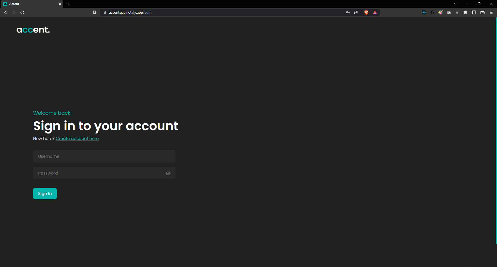

  - Registration Page  
     
    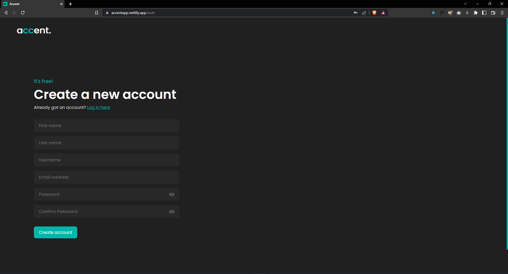

- ### Homepage

  - After successful login, the user is greeted with the Homepage  
     
    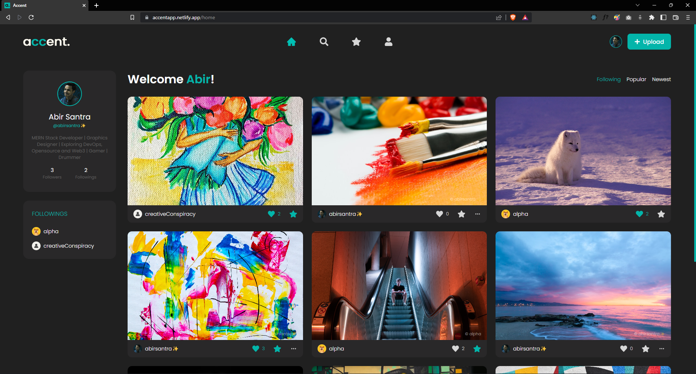

  - The left panel has the user's profile card and their followers  
     
    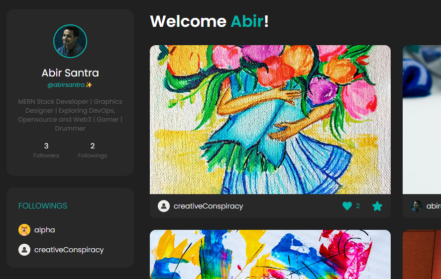

  - The user has the choice to select the type of feed they want to see.

    - "Following" - Feed only shows accents by creators whom the user follows as well as the user's posts. This is selected by default if the user follows atleast one creator.
    - "Popular" - Feed shows the most popular accents based on the number of likes. This is selected by default when the user does not follow anyone.
    - "Newest" - Feed shows the most recent posts first  
       
      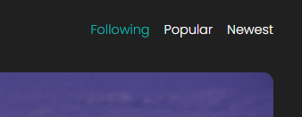

  - The Navbar has the logo on the left, the nav links in the middle and the upload button on the right as well as the options of settings and logout can be viewed on clicking the profile icon.
    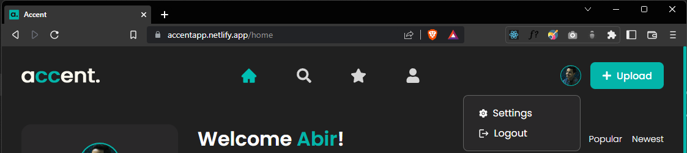

  - Post Card - Each post card has the post image, the username and buttons for liking and saving the post. The edit option is also available for the post's created by the user themselves.

    - Other creator's Accent

      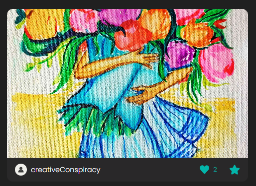

    - Current user's Accent with update and delete options when clicked
      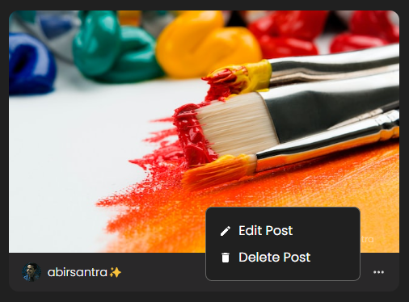
    - Edit Modal
      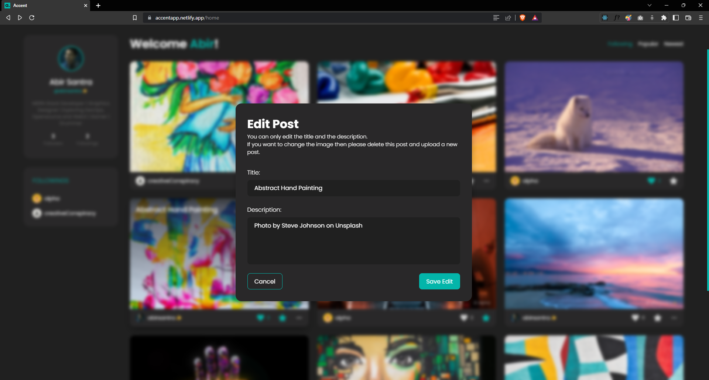
    - Delete Modal
      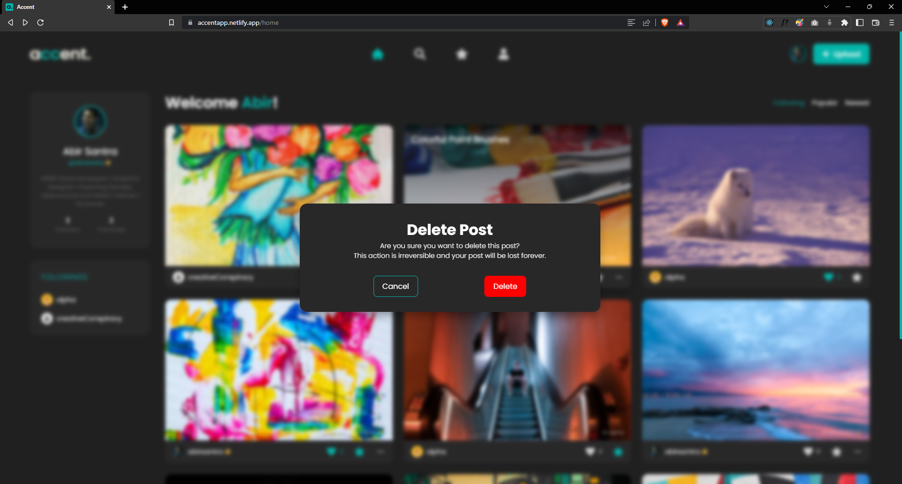

- ### Search Page

  - Users can search for other creators using their username, firstname or lastname.
    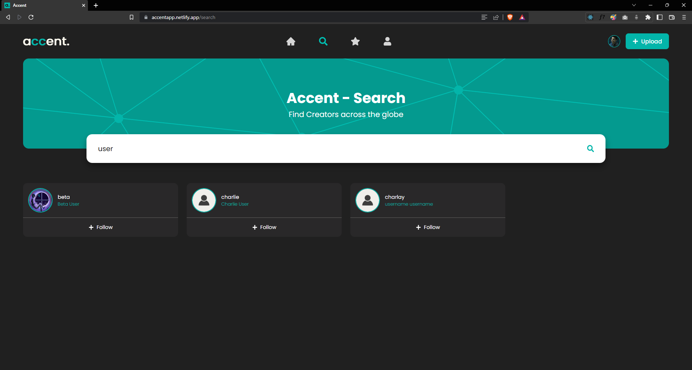

- ### Saved Page

  - Users can view their saved accents from this page
    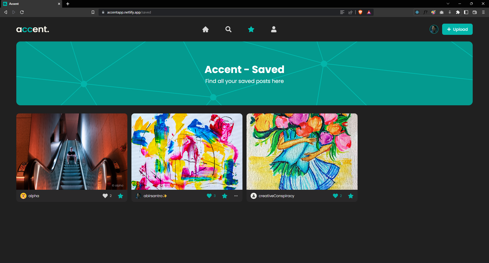

- ### Profile Page

  - Users can view their posts, followers and following on this page
    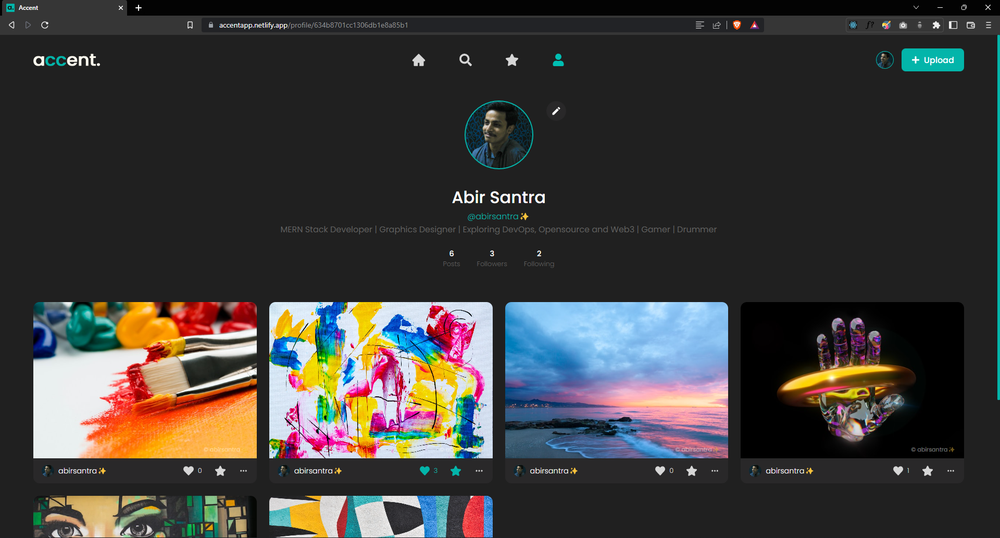

- ### Upload Page

  - Users can upload their accents on this page
    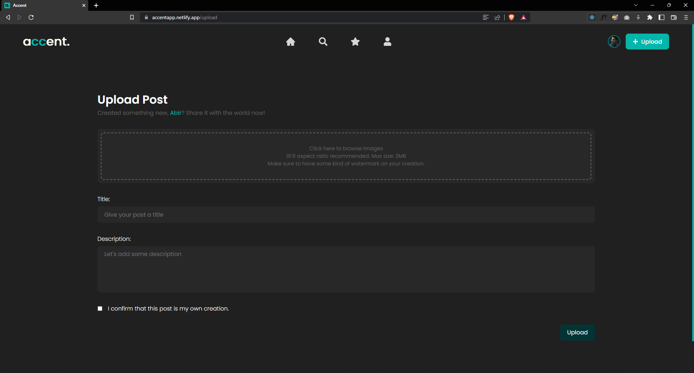

- ### Setting Page
  - Users can change their account settings on this page
    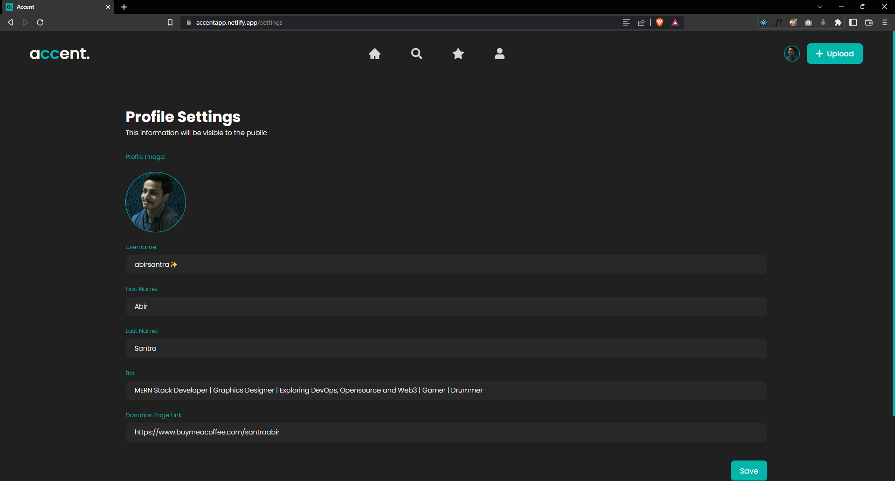

---

## Tech Stack

---

1. Figma - UI Design
2. React - Entire Frontend
3. Redux Toolkit - State Management
4. Node & Express - Backend Server
5. MongoDB - Database for users' and accents' data
6. Firebase Storage - CDN for Accent images
7. JWT - Authentication
8. Netlify - Frontend App Hosting
9. Cyclic - Backend Server Hosting

---

## Instructions

---

1. Clone the frontend repository
2. Clone the backend repository (link above)
3. Install node packages using `npm install` on both repositories
4. For frontend:
   - Replace firebase keys with your keys
   - Replace the baseurl in the 'api' files with your localhost
   - Replace the proxy in package.json
   - Start the server using `npm start`
5. For backend:
   - Replace mongodb URI with your mongodb atlas URI
   - Replace JWT secret with your own secret
   - Start the server using `npm run dev`
      
      

## Give me a star if you liked this project ⭐❤️
